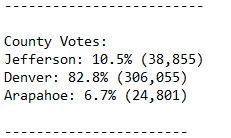

# Module_3_Challenge

## Overview of Election Audit: 

#### The purpose of this election audit analysis is to provide a summary of the provided data about the election with the inclusion of additional data.  
#### This additional data is as follows:
    - The voter Turnout for each county
    - The percentage of the total votes from each county out of the total count
    - The county with the highest turnout

## Election-Audit Results: 
Using a bulleted list, address the following election outcomes. Use images or examples of your code as support where necessary.

- How many votes were cast in this congressional election?
        - 1. Initialized Variable for Total Votes in Election

        - 2. Looped value for Total Votes in Election

        - 3. Print number of Total Votes in Election to a text file

        - 4. Number of Total Votes in Election in text file

- Provide a breakdown of the number of votes and the percentage of total votes for each county in the precinct.

        - 1. Initialized Variables for holding data

        - 2. For loop creating county list

        - 3. Text data for every countys total votes and percentage of total

- Which county had the largest number of votes?

        - 1. Initialized variables for largest county data

        - 2. Calculation of largest county data

        - 3. Text data for largest county data

- Provide a breakdown of the number of votes and the percentage of the total votes each candidate received.

        - 1. Initialized variables for candidate votes data

        - 2. For loop creating candidate list

        - 3. Calculation of candidate vote data

        - 4. Text data for every candidates total votes and percentage of total

- Which candidate won the election, what was their vote count, and what was their percentage of the total votes?

        - 1. Initialized variables for candidate votes data

        - 2. Calculation of winning candidate data

        - 3. Text data for the winning candidate

## Election-Audit Summary: 

#### This script is very easily customizable for any election with certain modifications.  The first thing that needs to be changed is the path to the data.

#### If some more variables are created for state data and the calculation of county data is changed for state data, this can easily be used for a national election.
#### This election will only need its own .csv file storing all of the vote data in the format provided for this script with the inclusion of state data.
